# Pipeline ELT Semi-Real-Time — Monitoramento de Consumo de Energia

<div align="center">


**Pipeline de dados event-driven com micro-batching, construído 100% com tecnologias open source e executado localmente via Docker Compose.**

[Ideia do Projeto](#-ideia-do-projeto) •
[Arquitetura](#-arquitetura) •
[Stack Tecnológica](#-stack-tecnológica) •
[Estrutura do Repositório](#-estrutura-do-repositório) •
[Como Rodar](#-como-rodar) •
[Roadmap](#-roadmap)

</div>

---

## Ideia do Projeto

### O Problema

Sistemas industriais e residenciais geram dados de consumo de energia continuamente. Arquiteturas tradicionais em **batch (D+1)** são lentas demais para detectar anomalias em tempo hábil. Por outro lado, soluções de **streaming puro** (latência sub-milissegundo) são complexas e caras de manter.

### A Solução

Este projeto implementa um pipeline **ELT semi-real-time** que ocupa o meio-termo: dados fluem com latência de **segundos a poucos minutos**, permitindo análises quase instantâneas com custo e complexidade reduzidos. A abordagem utiliza **micro-batching** para processar eventos em pequenas janelas de tempo.

### O Cenário de Negócio

O pipeline consome dados reais do dataset **[UCI — Individual Household Electric Power Consumption](https://archive.ics.uci.edu/dataset/235/individual+household+electric+power+consumption)**, que contém **~2 milhões de medições** de consumo energético residencial coletadas minuto a minuto ao longo de 4 anos. Um **Replayer** FastAPI reproduz esses dados históricos como se fossem eventos em tempo real, simulando sensores IoT de uma casa inteligente.

**Métricas ingeridas por evento:**

| Campo | Descrição |
|-------|-----------|
| `global_active_power` | Potência ativa global (kW) |
| `global_reactive_power` | Potência reativa global (kW) |
| `voltage` | Tensão (Volts) |
| `global_intensity` | Intensidade de corrente global (Ampères) |
| `sub_metering_1` | Sub-medição — Cozinha (Wh) |
| `sub_metering_2` | Sub-medição — Lavanderia (Wh) |
| `sub_metering_3` | Sub-medição — Aquecedor/Ar-cond. (Wh) |

---

## Arquitetura

O projeto adota a **Medallion Architecture** (Bronze → Silver → Gold), integrada a um fluxo de streaming de eventos.

### Diagrama de Fluxo

```
┌──────────────────┐       ┌──────────────────┐       ┌────────────────────────┐
│   DATA SOURCE    │       │  MESSAGE BROKER  │       │   STREAM PROCESSING    │
│                  │       │                  │       │                        │
│  ┌────────────┐  │ REST  │  ┌────────────┐  │ Kafka │  ┌──────────────────┐  │
│  │  FastAPI   │──┼──────▶│  │   Kafka    │──┼──────▶│  │  Apache Spark    │  │
│  │ (Replayer) │  │ JSON  │  │  (Topics)  │  │       │  │ Struct. Streaming│  │
│  └────────────┘  │       │  └────────────┘  │       │  └────────┬─────────┘  │
└──────────────────┘       └──────────────────┘       └───────────┼────────────┘
                                                                  │
                                                        Write Parquet (partitioned)
                                                                  ▼
                                                      ┌────────────────────────┐
                                                      │      DATA LAKE         │
                                                      │  ┌──────────────────┐  │
                                                      │  │      MinIO       │  │
                                                      │  │   (Raw / Bronze) │  │
                                                      │  └────────┬─────────┘  │
                                                      └───────────┼────────────┘
                                                                  │
                                                         Extract & Load
                                                                  ▼
┌──────────────────┐       ┌──────────────────┐       ┌────────────────────────┐
│  VISUALIZATION   │       │  DATA WAREHOUSE  │       │   DATA TRANSFORMATION  │
│                  │       │                  │       │                        │
│  ┌────────────┐  │ Query │  ┌────────────┐  │  SQL  │  ┌──────────────────┐  │
│  │  Superset  │◀─┼──────│  │ PostgreSQL │◀─┼──────│  │    dbt Core      │  │
│  │            │  │       │  │ (DW)       │  │       │  │                  │  │
│  └────────────┘  │       │  └────────────┘  │       │  └──────────────────┘  │
└──────────────────┘       └──────────────────┘       └────────────────────────┘

                     ╔══════════════════════════════════════╗
                     ║    OBSERVABILITY & MONITORING        ║
                     ║    Prometheus  ──▶  Grafana          ║
                     ╚══════════════════════════════════════╝
```

### Camadas da Medallion Architecture

| Camada | Armazenamento | Descrição |
|--------|--------------|-----------|
| **Bronze** | MinIO (Parquet) → PostgreSQL (`bronze` schema) | Dados brutos ingeridos sem transformação. Imutáveis, servem como source of truth. |
| **Silver** | PostgreSQL (dbt models) | Dados limpos, tipados e deduplicados. Regras de qualidade aplicadas. |
| **Gold** | PostgreSQL (dbt models) | Data Marts agregados e prontos para consumo analítico (BI / Dashboards). |

### Fluxo Detalhado dos Dados

```mermaid
flowchart LR
    A[" Dataset UCI\n(~2M registros)"] --> B[" FastAPI Replayer\n(simula eventos IoT)"]
    B -->|JSON via REST| C[" Apache Kafka\n(buffering & tópicos)"]
    C -->|Micro-batch| D[" Spark Structured\nStreaming"]
    D -->|Parquet particionado| E[" MinIO\n(Data Lake - Bronze)"]
    E -->|Extract & Load| F[" PostgreSQL\n(schema bronze)"]
    F -->|dbt transform| G[" Silver Models\n(dados limpos)"]
    G -->|dbt transform| H[" Gold Models\n(Data Marts)"]
    H -->|Query| I[" Superset\n(Dashboards)"]
```



---

## Stack Tecnológica


| Componente | Tecnologia |
|------------|-----------|
| **Fonte de dados** | FastAPI + Pydantic |
| **Message Broker** | Apache Kafka | 
| **Stream Processing** | Apache Spark (Structured Streaming) |
| **Data Lake** | MinIO | 
| **Data Warehouse** | PostgreSQL 15 |
| **Transformação** | dbt Core |
| **Visualização** | Apache Superset |
| **Monitoramento** | Prometheus + Grafana |
| **Orquestração** | Docker Compose | 


---

## Como Rodar

### Pré-requisitos

- [Docker](https://docs.docker.com/get-docker/) e [Docker Compose](https://docs.docker.com/compose/install/) instalados
- Dataset UCI baixado em `src/data/` (veja abaixo)

### 1. Clone o repositório

```bash
git clone https://github.com/antoniodcomp/projeto-pipeline-ETL-semi-real-time.git
cd projeto-pipeline-ETL-semi-real-time
```

### 2. Baixe o dataset

Baixe o arquivo `household_power_consumption.txt` do [UCI Machine Learning Repository](https://archive.ics.uci.edu/dataset/235/individual+household+electric+power+consumption) e coloque em:

```
src/data/household_power_consumption.txt
```

### 3. Configure as variáveis de ambiente

Crie um arquivo `.env` na raiz do projeto:

```env
APP_NAME="UCI Dataset Replayer"
FILE_PATH="/data/household_power_consumption.txt"
DEFAULT_HOUSE_ID="house_001"
DEFAULT_RATE=1.0
API_HOST="0.0.0.0"
API_PORT=8000
KAFKA_BOOTSTRAP_SERVERS="kafka:9092"
KAFKA_TOPIC="energy_consumption_events"
```

### 4. Suba os serviços

```bash
docker compose up --build
```

### 5. Interaja com o Replayer

```bash
# Health check
curl http://localhost:8000/health

# Iniciar o replayer
curl -X POST http://localhost:8000/start \
  -H "Content-Type: application/json" \
  -d '{"house_id": "HOUSE_001", "rate": 1.0}'

# Pausar o replayer
curl -X POST http://localhost:8000/pause
```

Acesse a documentação interativa da API em: **http://localhost:8000/docs**

---

## Licença

Este projeto é de uso educacional e pessoal.

---

<div align="center">

**Feito por [@antoniodcomp](https://github.com/antoniodcomp)**

</div>
